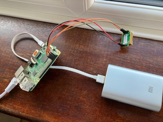
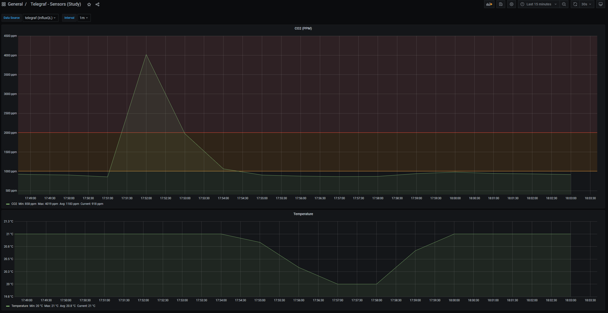

# Sensors
A hobby project to create a simple HTTP Server to expose sensors attached to a Raspberry Pi. This data then gets collected by Telegraf & made available by a dashboard in Grafana.

Code is containerised & cross-compiled with buildx, and then deployed onto the raspberry pi with:
```bash
git clone https://github.com/JoshKeegan/sensors
cd sensors/deploy
./install.sh
```

## Current sensors
 - MH-Z19C (CO2 sensor)

## Fetching data
HTTP GET to /sensors.  
Returns JSON. Fields are:

| Field | Measurement | Units | Sensor  |
| ----- | ----------- | ----- | ------- |
| co2   | CO2         | ppm   | MH-Z19C |
| tempC | Temperature | C     | MH-Z19C |

Notes: tempC is of unknown accuracy. The MHZ19C sensor needs to know the temperature to correct for it
        when calculating the CO2 concentration. When I tried it in the cold outside (~7C), it reported 2C so it shouldn't be considered to be particularlly accurate. Seems OK at room temperature though...

## Developing
 - Make your changes
 - Set up `docker buildx` (comes pre-installed with docker desktop) & then create a builder instance for cross-platform builds with `docker buildx create --use`
 - Run `make publish` to build & publish new docker containers
 - On the Pi, run `./update.sh` from the `deploy` directory to deploy it

## In action:
This program runs on a Raspberry Pi in my study:  


I already had [Telegraf](https://github.com/influxdata/telegraf) and [Grafana](https://github.com/grafana/grafana) running on a home server, using them for monitoring other systems, so having it also handle this is just a matter of updating the configuration...

Both the Telegraf config snippet and the Grafana dashboard (exported as JSON) are available in the `dashboard/` directory of this repo.  

The end result (the spike to 4000ppm is me breathing on the sensor to test it!):  


## References
 - [mh-z19 Python library](https://github.com/UedaTakeyuki/mh-z19) which is used to interact with the sensor
 - [MH-Z19C data sheet](https://www.winsen-sensor.com/d/files/infrared-gas-sensor/mh-z19c-pins-type-co2-manual-ver1_0.pdf)

## License
[MIT](LICENSE)